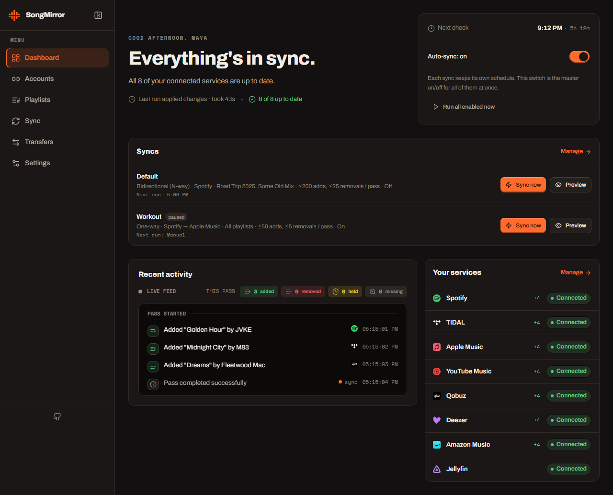
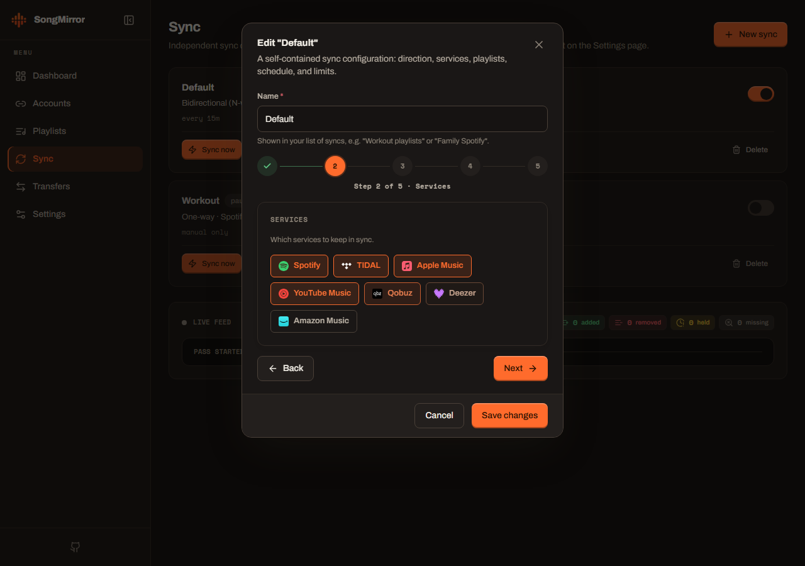
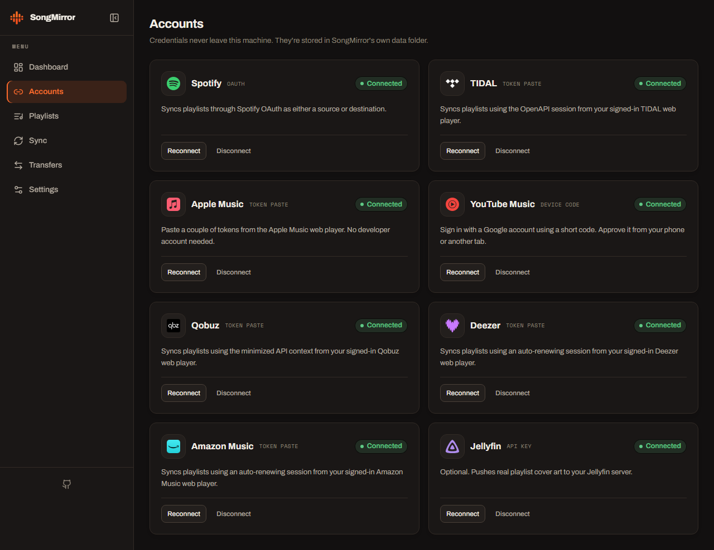
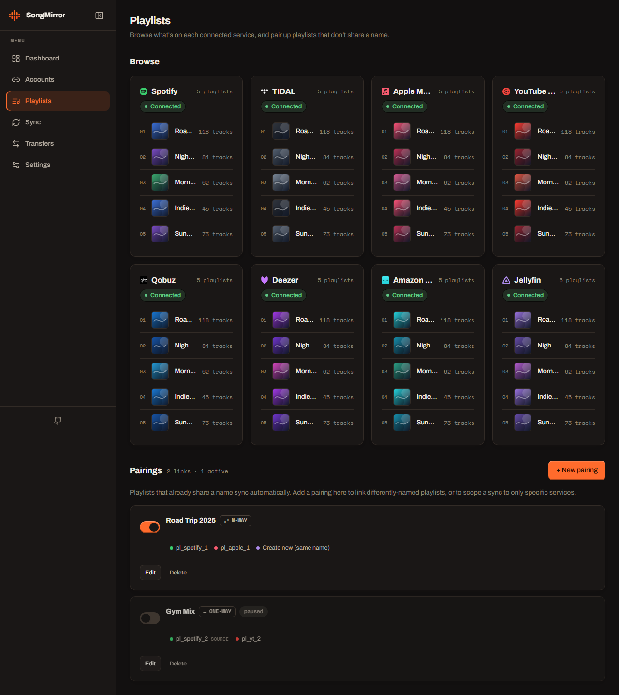

<div align="center"><a name="readme-top"></a>

**English** · [Português (Brasil)](README.pt-BR.md)

# Sync My Music

**Your self-hosted music control center.** Keep a canonical copy of your music
library, synchronize playlists across services, bridge open-source players, and
combine listening recaps without handing your history to another hosted platform.

Built for a private computer, home server, or Termux device and designed to be
used from your local network.

**Canonical library · cross-service playlist sync · version history · Musify export · Sonora backup/P2P bridge · unified listening recaps · searchable logs**

> [!IMPORTANT]
> Sync My Music is currently an early self-hosted release. The LAN dashboard has
> no application login yet. Do not expose it to the public internet or port-forward
> its port. Service tokens and browser-session credentials must be treated like passwords.

Sync My Music is an MIT-licensed adaptation of
[SongMirror](https://github.com/ahnafnafee/songmirror). SongMirror provides the
mature playlist matching, transfer, and reconciliation engine. This project adds
the canonical database, listening model, playlist recovery, operational UI, and
bridges for [Musify](https://github.com/gokadzev/Musify) and
[Sonora](https://github.com/gmstyle/sonora). See [Credits](#-credits) for details.

[Quick Start](#-quick-start) · [What it does](#-what-it-does) · [Integrations](#-integrations) · [Architecture](docs/architecture.md) · [Upstream sync](docs/upstream-sync.md) · [Roadmap](#-current-status-and-roadmap) · [Report Bug][github-issues-link]

<!-- SHIELD GROUP -->

[![CI][ci-shield]][ci-link]
[![License][license-shield]][license-link]
[![Python][python-shield]][python-link]
[![Docker][docker-shield]][docker-link]<br/>
[![Stars][stars-shield]][stars-link]
[![Forks][forks-shield]][forks-link]
[![Issues][issues-shield]][issues-link]
[![Last commit][last-commit-shield]][last-commit-link]

<sup>One private database for your music identity, even when your listening is spread across different apps.</sup>

</div>

> [!NOTE]
> **Web app + headless CLI, one engine.** Use the browser UI for accounts,
> playlists, recaps, recovery, and logs, or run the same synchronization core
> through `.env` and cron.

<details>
<summary><kbd>Table of contents</kbd></summary>

#### TOC

- [✨ What it does](#-what-it-does)
- [🔌 Integrations](#-integrations)
- [🧠 Data and recap model](#-data-and-recap-model)
- [🚧 Current status and roadmap](#-current-status-and-roadmap)
- [📸 Screenshots](#-screenshots)
- [🚀 Quick Start](#-quick-start)
- [🐳 Always running: Docker](#-always-running-docker)
- [⚙️ How it works](#-how-it-works)
  - [Matching](#matching)
  - [Bidirectional (N-way) sync](#bidirectional-n-way-sync)
- [💿 Local download mirror (Jellyfin)](#-local-download-mirror-jellyfin)
- [🔌 Connecting each service](#-connecting-each-service)
  - [Credential renewal](#credential-renewal)
  - [Spotify](#spotify)
  - [TIDAL](#tidal)
  - [Qobuz](#qobuz)
  - [Deezer](#deezer)
  - [Amazon Music](#amazon-music)
  - [Apple Music](#apple-music)
  - [YouTube Music](#youtube-music)
- [🖥️ Headless CLI](#️-headless-cli)
- [🛡️ Safety rails](#️-safety-rails)
- [🗃️ Caching &amp; song archive](#️-caching--song-archive)
- [🧱 Project layout](#-project-layout)
- [🩺 Troubleshooting](#-troubleshooting)
- [🤝 Credits](#-credits)
- [📄 License](#-license)

####

<br/>

</details>

## ✨ What it does

### A library that belongs to you

- **Canonical SQLite database** for tracks, artists, albums, service identities,
  playlists, ordered items, listening data, sync runs, and application logs.
- **Provider-aware identities** keep Spotify, YouTube, Apple Music, Sonora, and
  other catalog IDs attached to the same canonical recording.
- **Independent surfaces** for playlists, liked tracks, followed artists, saved
  albums/playlists, and listening summaries. Unsupported surfaces are skipped
  explicitly instead of being silently treated as empty.

### Playlist synchronization with recovery

- **One-way source-of-truth sync** or **bidirectional N-way reconciliation**.
- **Multiple named sync jobs**, each with its own services, playlist scope,
  schedule, addition limit, and removal limit.
- **One-off transfers** with progress, pause, resume, stop, and manual resolution
  for unmatched tracks.
- **ISRC-first matching**, cached provider links, and Unicode-aware fuzzy
  title/artist/duration fallback.
- **Bounded playlist versions** captured before mutations, with preview and
  recoverable restoration from the web interface.

### One listening recap across apps

- Append-only, deduplicated listening events through a
  ListenBrainz-compatible submission endpoint.
- Replaceable monthly snapshots for manual Musify and Sonora imports.
- Combined yearly and monthly views without writing fabricated listening history
  back to commercial services.
- Configurable calendar-year retention from 1 to 10 years (3 by default).

### Operations you can actually inspect

- Pause a problematic provider without deleting its imported data.
- Search and filter the latest 5,000 structured application logs in the UI.
- Preview writes, cap additions/removals, and fail closed when authentication or
  a provider read looks unsafe.
- Run with Docker, directly with Python, or on a small always-on Termux server.
- Export and restore a versioned whole-application ZIP; restores validate hashes
  and SQLite integrity and keep a bounded pre-restore recovery copy.

## 🔌 Integrations

| Service / app | Playlist sync | Other surfaces | Authentication / transport |
| --- | --- | --- | --- |
| **Spotify** | Read and write | Official export, history and catalog matching | OAuth or standalone `sp_dc` Web mode |
| **YouTube Music** | Read and write | Catalog matching | Data API OAuth or browser-session mode |
| **Apple Music** | Read and write | Catalog metadata | Pasted Bearer + Media-User-Token |
| **TIDAL** | Read and write | Catalog metadata | Pasted web-player Bearer |
| **Qobuz** | Read and write | Catalog metadata | Pasted web-player API headers |
| **Deezer** | Read and write | Catalog metadata | Renewable web `refresh-token` session |
| **Amazon Music** | Read and write | Catalog metadata | Minimized, renewable web session |
| **Jellyfin** | Browse / local mirror | Covers and local library | Server URL + API key |
| **Musify** | Export through custom playlist links | Replaceable recap import | Manual bridge; no Musify password stored |
| **Sonora** | Backup playlists and local entries | Likes, artists, albums, history | Backup-v2 ZIP or paired LAN P2P |

> [!WARNING]
> Browser-backed connectors use undocumented first-party web interfaces and may
> break when a service changes its web client. Every provider can be disabled
> independently while its local data remains available.

### Musify bridge

[Musify](https://github.com/gokadzev/Musify) remains an independent mobile app;
Sync My Music does not modify its Hive database or impersonate the app. Instead,
the bridge uses formats Musify can consume safely:

- Export a playlist from any readable provider, resolve its tracks to YouTube
  Music IDs, and generate a `musify://playlist/custom/...` link.
- Import Musify wrapped/listening-stat exports into the unified recap.
- Treat every imported month as a replacement snapshot, never as a new batch of
  plays to add on top of the previous export.

This keeps the workflow manual where Musify requires it while still making the
canonical database useful as a conversion and recovery layer.

### Sonora bridge

The [Sonora](https://github.com/gmstyle/sonora) adapter understands its backup-v2
structures and can exchange more than playlists:

- Liked songs, followed artists, liked albums, and liked playlists.
- Local playlists and their ordered entries.
- Listening history, imported as replaceable monthly recap snapshots.
- Backup ZIP import/export for explicit, portable transfers.
- Optional LAN discovery and peer synchronization using Sonora's device protocol.

LAN discovery is disabled by default. When enabled, pairing requires a PIN and
the user chooses which surfaces are exchanged. Search history and application
settings are intentionally excluded from the canonical music database.

## 🧠 Data and recap model

`data/sync_music.db` is the product database. Provider libraries are mirrors of
external state; the canonical entities are the durable local representation.
The original matching cache remains separate so catalog resolution and personal
library history do not become the same concern.

Listening data deliberately has two semantics:

- **Events** represent individual plays and are appended once, with source-ID or
  fingerprint deduplication.
- **Snapshots** represent totals exported manually by Musify or Sonora. Importing
  the same month again replaces that source/month. If July first contains 20
  minutes and a later export contains 40, the recap reports **40**, not 60.

See [docs/architecture.md](docs/architecture.md) for the complete schema,
surface model, playlist safety rules, and Sonora peer protocol.

## 🚧 Current status and roadmap

Already implemented:

- Canonical database and library UI.
- Existing SongMirror playlist engine, transfers, matching, and named sync jobs.
- Playlist version history and recovery.
- Musify playlist export and recap snapshot import.
- Sonora backup-v2 import/export and configurable LAN pairing/sync.
- Unified recaps, persistent logs, and per-provider pause switches.
- Official Spotify ZIP/JSON import with idempotent monthly/yearly history.
- Credential-free backup/restore per provider account, including isolated
  manual snapshots that can feed one-off transfers.
- Multiple live accounts per service, side by side: named profiles with
  isolated credentials, tokens, cookies and caches; per-account surfaces,
  pause switches, connect/reconnect, rename and confirmed removal; jobs,
  transfers and playlist browsing select accounts (`account_id`), so two
  Spotify accounts can participate in one sync.
- Recaps filtered by any combination of accounts (annual card, monthly
  history, top tracks/artists, minutes, plays and per-service breakdown).
- Live "Import playlists" per account: pulls the account's playlists through
  its own connector into the canonical library under that account's id.

Still evolving:

- Automatic liked-track, followed-artist, and saved-album adapters for every
  commercial provider (today: official exports / Musify / Sonora only — the UI
  marks each surface read-only or unsupported where no real adapter exists).
- Authentication and authorization suitable for exposing the dashboard outside
  a trusted LAN.
- More import formats, conflict tooling, integration tests, and refreshed project screenshots.

Contributions are welcome once the repository is public, especially provider
adapters that respect account security and clearly advertise their read/write
capabilities.

For a strict implemented/partial/foundation breakdown, see the
[product status and backlog (pt-BR)](docs/plans/product-backlog.pt-BR.md).

<div align="right">

[![][back-to-top]](#readme-top)

</div>

## 📸 Screenshots

> [!NOTE]
> These screenshots show the inherited playlist-management foundation. Updated
> captures of the Library, Recaps, Logs, Musify, and Sonora views are on the roadmap.

<div align="center">

**One dashboard for every library — sync status, jobs, live activity, and service health**



**Set up any number of syncs — one-way or bidirectional — in a short wizard**



**Connect every service in your browser — one-click OAuth, guided token paste, or an API key**



**Browse and pair playlists across services**



</div>

<div align="right">

[![][back-to-top]](#readme-top)

</div>

## 🚀 Quick Start

The fastest way to run it is Docker — the container serves the web UI and runs your syncs on schedule.

```bash
git clone https://github.com/elias001011/sync-my-music.git
cd sync-my-music
docker compose up -d
```

Then open **`http://localhost:8888`** and connect your services in the browser. That's it — **no `.env` to edit**; everything is configured in the UI and saved under `./data`.

Prefer running it without Docker?

```bash
uv sync
uv run uvicorn songmirror.web:app --host 0.0.0.0 --port 8080
# this machine: http://127.0.0.1:8080
# home LAN:     http://<server-ip>:8080
```

> Requires [`uv`](https://docs.astral.sh/uv/) (Python 3.13+). Do not forward this port to the public internet. The Sonora LAN bridge is disabled until you enable it under Accounts.

### Termux server

The Termux control script lives at `deploy/termux/sync-server`. Once installed
under `$PREFIX/bin/sync-server`, it keeps the database under
`~/sync-my-music/data`, writes its process log under `~/sync-my-music/runtime`,
and exposes the UI on home-LAN port `8888` by default.

```bash
sync-server start    # start in the background
sync-server stop     # stop without touching data
sync-server restart  # stop + start
sync-server reset    # alias for restart; it does not reset the database
sync-server status   # process, health check, LAN URL and paths
sync-server logs     # follow the process log (Ctrl+C only exits the viewer)
```

The service binds to `0.0.0.0` so devices on the same Wi-Fi can reach it, but
the router should not forward port `8888` to the public internet.

<div align="right">

[![][back-to-top]](#readme-top)

</div>

## 🐳 Always running: Docker

The Docker container is the recommended deployment: it serves the web UI, runs your syncs on their schedules, and restarts with the host. It runs as **`sync-my-music`** and persists the canonical database, auth, and caches in `./data`.

```bash
docker compose up -d --build     # build + start in the background
# open http://<host>:8888 and connect your services + create syncs in the browser
docker compose logs -f           # watch it work
```

**No `.env` is needed to start** — everything is configured in the browser and saved under `./data`. OAuth, partner-token, and API-key setup all live on the Accounts page; each wizard explains the service-specific prerequisites and exact callback URI. Then build your syncs on the Sync page.

| | |
| --- | --- |
| **Port** | The UI is published on host **8888** (the `8888:8080` mapping in `docker-compose.yml`; change the host side if it clashes). **LAN-only** — don't port-forward it to the internet; the UI has no login yet. |
| **Persistence** | `./data` holds the canonical database, playlist versions, recaps, logs, credentials, tokens, and caches. Back it up to keep your setup across rebuilds. |
| **Downloads** | Set `DOWNLOAD_DIR` (in `.env` or your shell) to your host music dir (e.g. `F:\Torrent\Music`); compose bind-mounts it to `/music`. From Docker, set `JELLYFIN_URL` to `http://host.docker.internal:8096`. |
| **Expired sessions** | Renewable sessions recover on the next scheduled or manual pass. TIDAL web, Qobuz, and Apple Music tokens must be re-pasted on the Accounts page when rejected; no restart is needed. |

<div align="right">

[![][back-to-top]](#readme-top)

</div>

## ⚙️ How it works

Every pass, for each selected playlist name that exists on the source:

1. Snapshot the source playlist (tracks, ISRCs, added-at dates).
2. Reconcile the same-named playlist on every selected, connected target concurrently through that service's account-authorized playlist API.
3. Missing tracks are resolved (cached links → ISRC → scored search) and appended oldest-first; tracks gone from the source are removed behind guards.
4. Optionally, [spotDL](https://github.com/spotDL/spotify-downloader) syncs a local audio folder per playlist.

The default source of truth is Spotify, but **one-way mode is provider-agnostic** — any connected playlist peer can be the source instead.

### Matching

Same hierarchy the cross-service tools use ([TuneLink](https://tommcfarlin.com/case-study-tunelink-matching-music-ai/), MusicBrainz): **hard identifier → search → fuzzy score**.

1. **Cached link** — once a source track is matched to a target's catalog id / video id, that link is stored and reused (immune to title drift).
2. **ISRC** — exact recording identity where the service exposes it.
3. **Scored search** — [RapidFuzz](https://rapidfuzz.com/) `token_set_ratio` + Jaro-Winkler, over both the raw and **romanized** ([anyascii](https://github.com/anyascii/anyascii)) title and artist, anchored by duration. This handles, without hardcoding:
   - **Multi-artist credits** — one service lists every feature, another lists the primary (`Arijit Singh, Ved Sharma, …` ↔ `Arijit Singh`).
   - **Title decoration** — `(feat. …)`, `- 2015 Remaster`, `(From "…")`, extra "Official Music Video" suffixes.
   - **Transliteration** — Cyrillic / Bengali / Greek / Arabic (`Камин` ↔ `Kamin`, `নেশার বোঝা` ↔ `Neshar Bojha`).
   - **Video-only tracks** — YouTube search falls back to the `videos` filter for indie/OST tracks that live on YT only as uploads.

The **duration anchor** unlocks the looser title match, so a different version (`Runaway - Piano Version`) or a wrong-artist cover isn't accepted when its length disagrees. Tracks with no confident match are reported and skipped.

### Bidirectional (N-way) sync

By default one provider is the source of truth and edits flow one way. In **N-way mode** every selected provider is a peer: add or remove a track on any one and the change propagates to the others.

Bidirectional sync is impossible statelessly, so each logical playlist's canonical membership is snapshotted after every clean pass. Each pass diffs every provider against that snapshot, unions the changes, and reconciles everyone to the result:

- **Echo-free** — a propagated add becomes part of the snapshot, so it's never bounced back.
- **Add-wins** on conflict — losing a song is worse than keeping an extra one.
- **Read-collapse guard** — if a provider suddenly reads far fewer tracks than the baseline (a transient API hiccup), it's skipped that pass so one bad read can't cascade a mass-delete.
- **Same rails as one-way** — per-pass `MAX_ADDS` / `MAX_REMOVALS` caps and net-loss protection hold on every write side.
- **Removals are opt-in** — `MAX_REMOVALS` defaults to 0, so a track that disappears from one provider (deleted there, or silently pulled by licensing) is kept on the others and only logged. Set a cap (or the UI's "Mirror removals" toggle) to propagate deletions.

> **Always dry-run first.** Run without `--execute` (or use **Preview** in the UI) and read the plan — it prints every proposed add/remove on every provider before anything is written.

<div align="right">

[![][back-to-top]](#readme-top)

</div>

## 💿 Local download mirror (Jellyfin)

Keep an offline audio copy of each synced playlist, one folder per playlist, via [spotDL](https://github.com/spotDL/spotify-downloader). Sync is true mirroring: new tracks are downloaded, removed tracks are deleted locally. The layout is **Jellyfin-ready** — point a Jellyfin music library at the download dir and both the tracks and the playlists appear, staying updated every pass:

```text
<DOWNLOAD_DIR>/
  <Playlist>/
    <Playlist>.m3u8          # auto-(re)generated; Jellyfin imports it as a playlist
    cover.jpg                # the source playlist cover, highest resolution
    <AlbumArtist>/
      <Album>/
        Artists - Title.mp3  # tagged + cover art embedded
```

Enable it by setting `DOWNLOAD_DIR` and installing spotDL + ffmpeg:

```bash
uv tool install spotdl       # isolated CLI; or: pipx install spotdl
# ffmpeg required: winget install ffmpeg   (or: spotdl --download-ffmpeg)
```

- **Incremental** — after the first full download, only newly-added tracks are fetched; removed tracks (and their emptied album folders) are pruned. An interrupted run continues next pass.
- **Newest-first `.m3u8`** — written in date-added order, newest at the top (set `LOCAL_MIRROR_ORDER=oldest` to flip). Rebuild covers / tags / mtimes from existing files with `uv run main.py --refresh-local`.
- **Playlist covers in Jellyfin** — Jellyfin ignores a cover file next to an m3u, so set `JELLYFIN_URL` + `JELLYFIN_API_KEY` and each pass uploads the real playlist cover via the Jellyfin API.
- **Audio quality** — the source is YouTube, so without a YT Music **Premium** cookie the ceiling is ~128–160 kbps. `LOCAL_MIRROR_FORMAT=opus` keeps YouTube's native stream without an mp3 re-encode; a Premium cookie (`LOCAL_MIRROR_COOKIE_FILE`) unlocks 256 kbps AAC. Selecting `flac` changes the output container but cannot turn a lossy source into lossless audio.

Monochrome's current FLAC path uses browser-gated, single-use playback resources rather than a stable, provider-authorized file-export API, so Sync My Music does not automate it. Use the local mirror only for content you own or are otherwise authorized to copy.

<div align="right">

[![][back-to-top]](#readme-top)

</div>

## 🔌 Connecting each service

In the web app, the **Accounts** page walks you through each service and shows the exact values to paste. Nothing is proxied through a third party.

### Credential renewal

Sync My Music refreshes credentials **just in time**, not with a separate token-refresh timer. Every manual or scheduled sync pass validates the connectors it uses and renews supported access tokens before the first request (or once after an authentication rejection). It is normal for a short-lived access token to expire between passes—the durable refresh token or renewal cookie is what matters. The Accounts page validates status when it loads or regains focus, but it is not the background keep-alive; enabled sync schedules are.

| Service | Renewal behavior |
| --- | --- |
| **Spotify** | OAuth access tokens refresh automatically from the saved refresh token when a client is built. Cookie mode mints a web access token from the saved `sp_dc` cookie on demand and retries with a new token after a `401`; the underlying cookie can still be revoked. |
| **TIDAL** | A pasted web-player Bearer cannot be renewed and must be captured again after expiry. The optional developer OAuth fallback refreshes automatically when a refresh token is available. |
| **Qobuz** | The pasted `X-User-Auth-Token` is used until Qobuz rejects it, then must be captured again. |
| **Deezer** | The short-lived Pipe JWT renews automatically from the saved `refresh-token` before use and once after a `401/403`; rotated renewal state is persisted. |
| **Amazon Music** | The web access token renews from the allowlisted signed-in browser cookies shortly before known expiry and once after a `401/403`; refreshed device context and rotated cookies are persisted. Logout, security changes, or server-side revocation still require a fresh capture. |
| **Apple Music** | The pasted Bearer and Media-User-Token cannot be renewed by Sync My Music and must be captured again after rejection. |
| **YouTube Music** | Data API OAuth refreshes automatically within 60 seconds of expiry. Browser mode attempts Google's cookie rotation whenever a sync target is built; an already-expired browser session must be exported again. |
| **Jellyfin** | The API key has no access-token refresh cycle; replace it only if it is revoked or deleted. |

### Spotify

Choose either connection mode in Accounts:

- **Web/cookie:** paste the `sp_dc` cookie from a signed-in
  `open.spotify.com` session. It lists the recursive rootlist (including folders
  and saved playlists), reads playlists, searches the catalog and performs
  playlist writes without a developer app or Premium. The UI reports an expired
  or revoked cookie instead of returning an empty playlist list.
- **OAuth:** create an app at <https://developer.spotify.com/dashboard>, copy its
  client ID/secret, and register the exact loopback redirect shown by the wizard.

The Library page also imports Spotify's official account-data ZIP/JSON. Playlist
and Your Library snapshots enter a named account slot; normal and extended
streaming history feed recaps using stable event fingerprints, so reimporting an
overlapping export does not add the same play again.

The web UI requests read + write scopes up front (Spotify is a write target in N-way syncs and reverse transfers). The CLI reads Spotify read-only in one-way mode.

### TIDAL

Sign in at <https://listen.tidal.com>, open DevTools → **Network**, open a playlist, and filter for `openapi.tidal.com/v2`. Copy a request's headers (or copy it as cURL) into the wizard. Sync My Music keeps only the Bearer token and two-letter catalog country. An existing developer OAuth token remains supported as an environment fallback.

Only catalog metadata and the signed-in user's playlists are used; playback assets are outside this integration. Browser tokens are short-lived, so re-paste when the account reports **Expired**.

### Qobuz

Sign in at <https://play.qobuz.com>, open DevTools → **Network**, and filter for `api.json/0.2`. Choose any request containing `X-App-Id` and `X-User-Auth-Token`—including an authenticated `album/story` request—then copy its request headers or copy it as cURL and paste it into the wizard. Sync My Music persists only those two values, sends them using the same header-based flow as the web player, and discards cookies and unrelated browser metadata. No business API approval or user id is required; existing partner credentials remain a compatible environment fallback.

The adapter uses catalog search and playlist endpoints only—it does not request stream or file URLs.

### Deezer

Sign in at <https://www.deezer.com>, open DevTools → **Network**, and reload the page. Filter for `auth.deezer.com/login/renew`, copy that request's headers (or copy it as cURL), and paste it into the renewal field. Firefox may instead copy the request cookies as a bare semicolon-delimited block; that shape is accepted too. Sync My Music retains only the dedicated `refresh-token` cookie and uses it to renew Deezer's short-lived Pipe JWT automatically. You may also paste a current `pipe.deezer.com/api` request as an immediate bootstrap, but it is not required when renewal is configured. Playlist additions and removals both use the renewable Pipe session; no `arl` cookie is needed. Existing developer OAuth tokens remain a compatible environment fallback.

### Amazon Music

No developer approval is required for the default connector. It uses the same authenticated GraphQL and token-renewal routes as the Amazon Music web player:

1. Sign in at <https://music.amazon.com> and open DevTools → **Network**.
2. Reload the page, filter for `config.json`, and select the signed-in request. (`pandaToken` works too when it appears, but it is not required.)
3. Choose **Copy request headers** or **Copy as cURL**, then paste it into the renewal field.
4. Optionally copy the signed-in `config.json` **Response** into the bootstrap field; Sync My Music can normally fetch that device context using the renewal session.

Sync My Music derives the same `AmznMusic` authorization value locally and refreshes it through `music.amazon.com/pandaToken` before expiry or once after an authentication rejection. It stores only a named allowlist of Amazon authentication/session cookies plus limited Music-client device context; analytics, experiment, AWS-console, CSRF, and other unrelated browser data are discarded. Those retained cookies are still sensitive, so keep Sync My Music private on your LAN. A logout, password/security change, or Amazon-side revocation can still require one fresh capture.

This is an unsupported first-party web-client interface and Amazon can change it without notice. The documented [Amazon Music Web API](https://developer.amazon.com/docs/music/API_web_overview.html) is still a closed beta; approved partner credentials remain an optional fallback when configured through environment variables.

### Apple Music

No Apple Developer account needed — two headers from `music.apple.com` are enough. Open <https://music.apple.com>, sign in, open DevTools → **Network**, play a song, filter for `amp-api.music.apple.com`, and from any request's headers copy:

- `authorization: Bearer eyJ...` → **Bearer token** (the `eyJ...` part, without `Bearer `)
- `media-user-token: ...` → **User token** (full value)

The connect wizard lets you paste the raw headers and parses the values for you. Tokens last months; re-paste them on the Accounts page when they expire.

### YouTube Music

Talks to the **official [YouTube Data API v3](https://developers.google.com/youtube/v3)**, whose OAuth refresh token is durable and survives restarts.

1. In the [Google Cloud console](https://console.cloud.google.com), create a project, enable **YouTube Data API v3**, and create an OAuth client of type **TVs and Limited Input devices**.
2. On the **OAuth consent screen**, set **Publishing status → In production** (leaving it in "Testing" expires the token after 7 days).
3. In the app, paste the client ID + secret and complete the on-screen device code.

> **Quota**: the Data API allows 10,000 units/day (a search costs 100, an add/remove 50). Steady-state upkeep is cheap; a big first-time backlog can hit the cap and resume the next day.

<div align="right">

[![][back-to-top]](#readme-top)

</div>

## 🖥️ Headless CLI

Prefer `.env` + cron / Task Scheduler? The same engine runs headless.

```bash
uv sync
cp .env.example .env            # fill in credentials
uv run main.py                  # dry run — prints every add/remove it *would* do
uv run main.py --execute        # apply for real
```

Useful flags:

```bash
uv run main.py --execute --playlists "Aurora,Chill"   # only these pairs
uv run main.py --execute --loop --interval 15m        # run forever
uv run main.py --execute --max-removals 100           # one-off larger cleanup
```

Key env vars (see `.env.example`): the credentials for whichever providers you use, `PLAYLISTS`, `SYNC_INTERVAL`, `MAX_ADDS` / `MAX_REMOVALS`, `DOWNLOAD_DIR`, `SYNC_MODE=nway`, and `PROVIDERS`.

<div align="right">

[![][back-to-top]](#readme-top)

</div>

## 🛡️ Safety rails

Removals are destructive, so they're guarded:

- **Dry run is the default** — nothing changes without `--execute` (or the UI's real-sync action).
- If the source returns 0 tracks for a playlist the target shows as non-empty, removals are skipped that pass (a transient API failure can't empty a playlist).
- **Removals are off by default** — `MAX_REMOVALS=0` holds every removal back (logged, never applied), so a licensing takedown on one platform can't cascade a deletion to the rest. Opt in per sync with the "Mirror removals" toggle (or set `MAX_REMOVALS`), and even then more pending removals than the cap in one pass → all skipped and logged.
- More than `MAX_ADDS` pending additions → the rest continue next pass (giant one-burst backfills are what trip bot detection).
- **Net-loss protection** — a target-side track resembling a source track that has no match on that service is held, not deleted.
- Any provider authentication failure aborts that provider's pass immediately — no partial deletes on expired tokens.

<div align="right">

[![][back-to-top]](#readme-top)

</div>

## 🗃️ Caching &amp; song archive

Everything resolvable is cached so steady-state passes are near-instant: per-service resolve caches (ISRC + search, including misses), a `snapshot_id`-keyed track-list cache, hard identifier links in SQLite, and a per-pair snapshot-skip (`unchanged since last clean sync`).

Every pass also archives the metadata of every track it sees into `song_cache.db` — a SQLite file that only ever grows. Removed tracks stay archived with name, artist, album, duration, ISRC, raw snapshot JSON, and first/last-seen timestamps:

```bash
sqlite3 song_cache.db "SELECT name, artist, album, first_seen FROM songs ORDER BY first_seen DESC LIMIT 20"
```

<div align="right">

[![][back-to-top]](#readme-top)

</div>

## 🧱 Project layout

CLI entry: `uv run main.py` (thin shim) or `python -m songmirror`. Web entry: `songmirror.web:app`.

```text
songmirror/
  engine/       # provider-agnostic sync core (no web deps): runner, matching, targets/, spotify, downloads, archive
  services/     # accounts, canonical DB, playlists, transfers, recaps, Sonora, settings, and logs
  web/          # FastAPI app: thin HTTP/SSE over services/ (routers/)
frontend/       # React + Vite SPA (built and served by the API in production)
data/           # runtime-only database, credentials, versions, recaps, logs, and provider caches
docs/           # architecture and synchronization semantics
```

**Adding another service**: subclass `MirrorTarget`, implement ~8 methods, add its builder to `engine/targets`' `_REGISTRY`, and add a matching `Connector` under `services/accounts`. All reconciliation — diff, ordering, safety rails, logging, snapshot-skip — is inherited.

<div align="right">

[![][back-to-top]](#readme-top)

</div>

## 🩺 Troubleshooting

- **`Missing required environment variable`** — fill in `.env` (CLI) or connect the service in the UI.
- **TIDAL, Qobuz, or Apple reports `Expired` / `401` / `403`** — these pasted sessions have no renewable secret; capture a fresh signed-in request or token in Accounts.
- **Deezer renewal fails** — capture a fresh `auth.deezer.com/login/renew` request (or its `refresh-token` cookie). A current Pipe Bearer alone is only a temporary bootstrap.
- **Amazon Music renewal fails** — capture a fresh signed-in `config.json` request. The response JSON is optional; the request's allowlisted authentication cookies are the durable renewal material.
- **YouTube Music browser mode expires** — export fresh browser request headers. For the most durable unattended setup, use Data API OAuth with an in-production consent screen.
- **Spotify OAuth redirect mismatch** — the redirect URI in your Spotify app must exactly match the one the wizard shows (including the port).
- **A playlist isn't syncing** — confirm it's in the sync's playlist scope and exists on the source (targets are auto-created on a real pass).

<div align="right">

[![][back-to-top]](#readme-top)

</div>

## 🤝 Credits

Sync My Music exists because several open-source projects made different parts
of a user-owned music stack possible:

- [SongMirror](https://github.com/ahnafnafee/songmirror), created by
  [Ahnaf An Nafee](https://github.com/ahnafnafee), is the foundation for service
  connectors, track matching, playlist reconciliation, transfers, safety rails,
  and much of the original web interface.
- [Musify](https://github.com/gokadzev/Musify) inspired and defines the custom
  playlist-link bridge and manual listening-stat import surface.
- [Sonora](https://github.com/gmstyle/sonora) defines the backup-v2 structures
  and device-to-device synchronization surface used by the Sonora bridge.

Sync My Music is an independent community adaptation. It is not affiliated with
Spotify, Google/YouTube, Apple, TIDAL, Qobuz, Deezer, Amazon, Jellyfin, or the
maintainers of Musify and Sonora. Product names are used only to describe
interoperability.

## 📄 License

This project is distributed under the [MIT License](./LICENSE).

The original SongMirror copyright and license notice are preserved as required
by the MIT License. New Sync My Music contributions are distributed under the
same license unless stated otherwise.

<!-- LINK GROUP -->

[back-to-top]: https://img.shields.io/badge/-BACK_TO_TOP-151515?style=flat-square
[ci-shield]: https://img.shields.io/github/actions/workflow/status/elias001011/sync-my-music/ci.yml?branch=main&label=CI&labelColor=black&logo=githubactions&logoColor=white&style=flat-square
[ci-link]: https://github.com/elias001011/sync-my-music/actions/workflows/ci.yml
[license-shield]: https://img.shields.io/github/license/elias001011/sync-my-music?color=F2601A&labelColor=black&style=flat-square
[license-link]: https://github.com/elias001011/sync-my-music/blob/main/LICENSE
[python-shield]: https://img.shields.io/badge/python-3.13%2B-F2601A?labelColor=black&logo=python&logoColor=white&style=flat-square
[python-link]: https://www.python.org/
[docker-shield]: https://img.shields.io/badge/docker-ready-F2601A?labelColor=black&logo=docker&logoColor=white&style=flat-square
[docker-link]: https://github.com/elias001011/sync-my-music/blob/main/docker-compose.yml
[stars-shield]: https://img.shields.io/github/stars/elias001011/sync-my-music?color=F2601A&labelColor=black&logo=github&logoColor=white&style=flat-square
[stars-link]: https://github.com/elias001011/sync-my-music/stargazers
[forks-shield]: https://img.shields.io/github/forks/elias001011/sync-my-music?color=F2601A&labelColor=black&logo=github&logoColor=white&style=flat-square
[forks-link]: https://github.com/elias001011/sync-my-music/network/members
[issues-shield]: https://img.shields.io/github/issues/elias001011/sync-my-music?color=F2601A&labelColor=black&logo=github&logoColor=white&style=flat-square
[issues-link]: https://github.com/elias001011/sync-my-music/issues
[last-commit-shield]: https://img.shields.io/github/last-commit/elias001011/sync-my-music?color=F2601A&labelColor=black&logo=github&logoColor=white&style=flat-square
[last-commit-link]: https://github.com/elias001011/sync-my-music/commits/main
[github-issues-link]: https://github.com/elias001011/sync-my-music/issues
